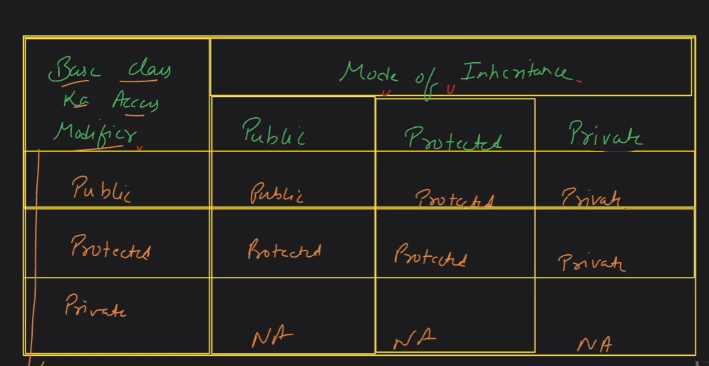

### Encapsulation
Encapsulation is the bundling of data and functions that operate on the data into a single unit, called a class. Data members of a class are typically declared as private, which means they can only be accessed or modified by member functions of the class. This helps in hiding the internal implementation details of a class and provides better control over the data.

if all Data members of a class are declared as private called perfect encapsulation. We can access that data members using getters and setters


### Inheritance
Inheritance is a mechanism where a new class (derived class) is created from an existing class (base class), inheriting its properties and behaviors. This facilitates code reuse and promotes a hierarchical relationship between classes. Derived classes can access the members of the base class, either directly or through member functions.


Base class / super class / parent class --> inherit --> subclass / childclass 

 - mode of inheritance -
1. private
2. public
3. protected



protected data members can access in the child class but can't access outside.


- types of inheritance -
  1. single - In single inheritance, a derived class inherits from only one base class. This is the simplest form of inheritance.
  ```cpp

  class BaseClass {
      // Base class members
  };

  class DerivedClass : public BaseClass {
      // Derived class members
  };

  ```

  2. multi-level
  3. multiple
  4. hierarchical
  5. hybrid

