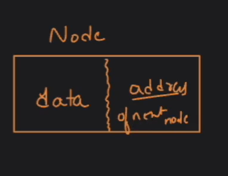
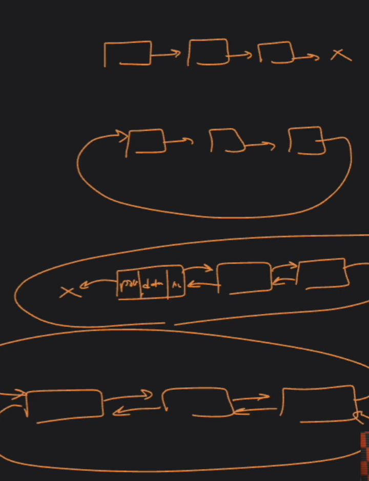

## Linked List

- Non linear data starture. It is collection of nodes.

  Node = Element | Next memory address(pointer to a next node)
  

- able to dynamically grow and shrink

### Types of LL

1. Singly linked list

2. Circular singly linked list

3. Doubly linked list

4. Circular double linked list

