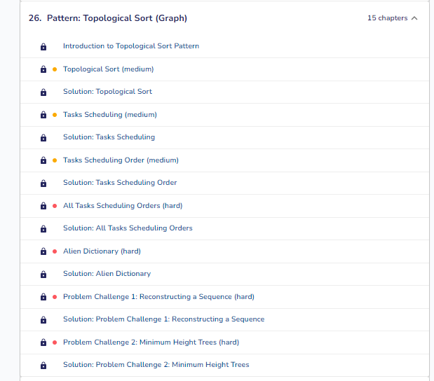
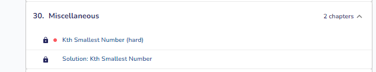

### Resources

- YT - https://www.youtube.com/watch?v=GPIuPRqDGG8&list=PPSV&ab_channel=DaveBurji

- NeetCode Roadmap - https://neetcode.io/roadmap

- Cheatsheet - https://www.techinterviewhandbook.org/algorithms/study-cheatsheet/

### Patterns

### Rivision PDF

[Revision.pdf](revision.pdf)

